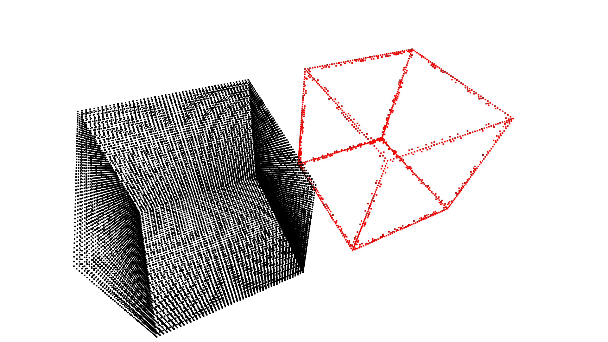

# Fast Sampling of Point Cloud using Graphs

The idea is motivated from the paper: [Fast Resampling of Three-Dimensional Point Clouds via Graphs](https://ieeexplore.ieee.org/abstract/document/8101025).

## Code
The code is implemented in `Python` and `C++`.

### Requirements
- [pybind11](https://pybind11.readthedocs.io/en/stable/)
- [Open3D](http://www.open3d.org/)
- [NumPy](https://numpy.org/)
- [Eigen](http://eigen.tuxfamily.org/index.php?title=Main_Page)
- [OpenMP](https://www.openmp.org/)

## Usage
#### Compilation
```bash
cmake -S . -B build -DCMAKE_BUILD_TYPE=Release
cmake --build build/
```
```python
python sample_point_cloud.py data/cube.ply
```

## Results
#### 1. Cube

**Input point cloud in black color, filtered point cloud in red color*


## Reference

@article{chen2017fast,
  title={Fast resampling of three-dimensional point clouds via graphs},
  author={Chen, Siheng and Tian, Dong and Feng, Chen and Vetro, Anthony and Kova{\v{c}}evi{\'c}, Jelena},
  journal={IEEE Transactions on Signal Processing},
  volume={66},
  number={3},
  pages={666--681},
  year={2017},
  publisher={IEEE}
}